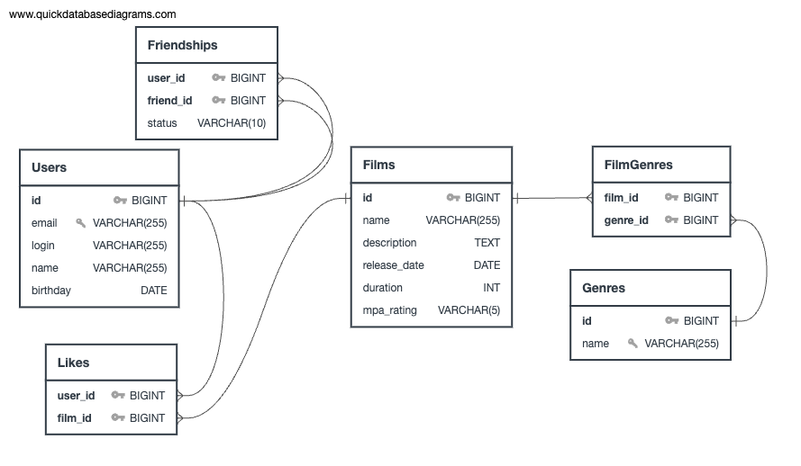

# Схема базы данных



## Описание схемы

Схема базы данных включает следующие таблицы:
- **Users**: информация о пользователях.
- **Films**: информация о фильмах.
- **Genres**: информация о жанрах фильмов.
- **FilmGenres**: связи между фильмами и их жанрами.
- **Likes**: лайки пользователей к фильмам.
- **Friendships**: информация о дружбе между пользователями.

## Примеры запросов

### Получение всех фильмов:
```sql
SELECT * FROM Films;
```
### Получение всех пользователей:
```
SELECT * FROM Users;
```
### Получение топ N наиболее популярных фильмов:
```
SELECT f.*, COUNT(l.filmId) as likeCount
FROM Films f
LEFT JOIN Likes l ON f.id = l.filmId
GROUP BY f.id
ORDER BY likeCount DESC
LIMIT N;
```
### Получение списка общих друзей двух пользователей:
```
SELECT u.*
FROM Users u
JOIN Friendships f1 ON u.id = f1.friendId AND f1.userId = :userId1 AND f1.status = 'CONFIRMED'
JOIN Friendships f2 ON u.id = f2.friendId AND f2.userId = :userId2 AND f2.status = 'CONFIRMED';
```
